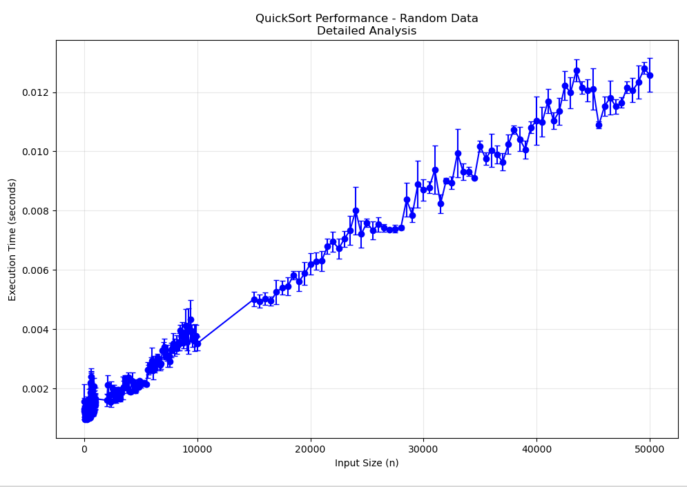

# Assignment 1 - 1 August 2025
> Anmol Sharma - `2024UCS1663`

### Question
Sort a given set of elements using the Quicksort method and determine the time required to sort the elements. Repeat the experiment for different values of n, the number of elements in the list to be sorted and plot a graph of the time taken versus n. The elements can be read from a file or can be generated using the random number generator

# Code

```cpp
#include <bits/stdc++.h>
using namespace std;

int partitionVec(vector<int>& a, int l, int r) {
    int pivot = a[r];
    int i = l;
    for (int j = l; j < r; ++j) {
        if (a[j] <= pivot) {
            swap(a[i], a[j]);
            ++i;
        }
    }
    swap(a[i], a[r]);
    return i;
}

void quickSort(vector<int>& a, int l, int r) {
    if (l >= r) return;
    int p = partitionVec(a, l, r);
    quickSort(a, l, p - 1);
    quickSort(a, p + 1, r);
}
int main() {
    int len;
    cin >> len;
    vector<int> arr(len);
    for (int i = 0; i < len; i++) cin >> arr[i];

    if (len > 0) quickSort(arr, 0, len - 1);
    for (int i = 0; i < len; ++i) {
        if (i) cout << ' ';
        cout << arr[i];
    }
    if (len) cout << '\n';
    
    return 0;
}
```

# Time Complexity

## Basic Analysis

QuickSort's time complexity depends on how the pivot divides the array:

### Best Case: `O(n log n)`
- Pivot always divides array into two equal halves
- Depth of recursion: log n
- Work at each level: O(n)
- Total: O(n log n)

### Average Case: `O(n log n)`
- On average, pivot divides array in a efficient manner
- Total: O(n log n)

### Worst Case: `O(n²)`
- Pivot is always the smallest or largest element
- Happens when array is already sorted (with last element as pivot)

# Graph

The attached graph was plotted with the following sizes:

```
10, 20, ..., 100
200, 300, ..., 1000
2000, 3000, ..., 10000
15000, 20000, ..., 50000
```


**Computed graph:**

