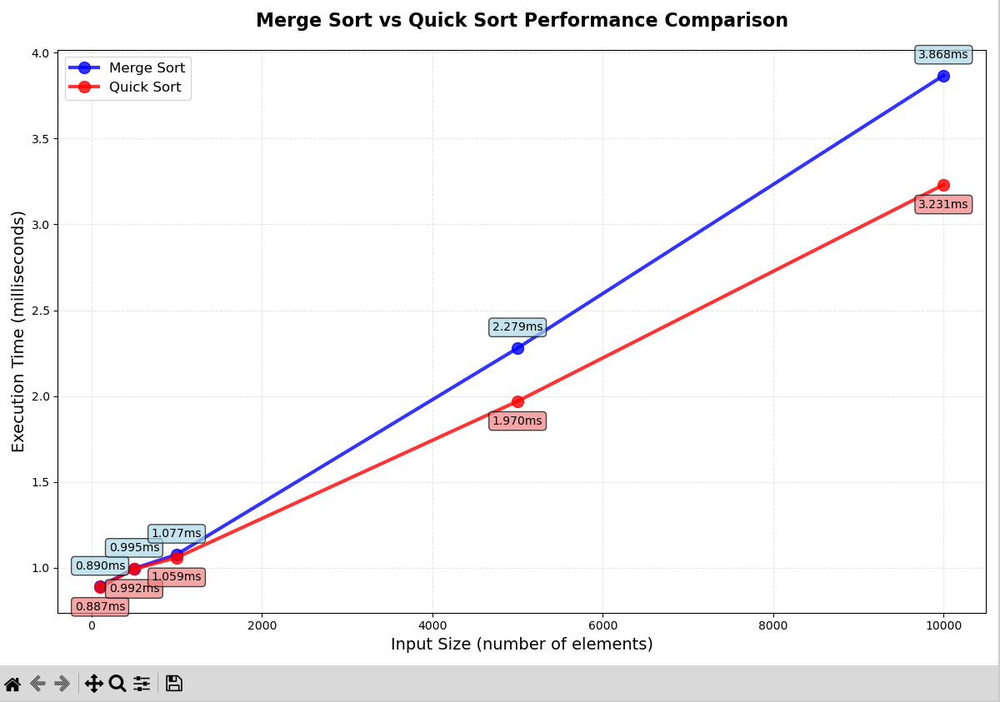

# Assignment 2 - 8 August 2025
> Anmol Sharma - `2024UCS1663`

### Question
Write a program that implements Merge sort sorting methods to sort a given list of integers in ascending order. Compare its running time on input size 10, 100, 1000, 10000 random numbers with quick sort. Show the comparison result graphically.

# Code

```cpp
#include <bits/stdc++.h>
using namespace std;

void merge(vector<int>& arr, int left, int mid, int right) {
    int n1 = mid - left + 1;
    int n2 = right - mid;
    
    vector<int> L(n1), R(n2);
    
    for (int i = 0; i < n1; i++)
        L[i] = arr[left + i];
    for (int j = 0; j < n2; j++)
        R[j] = arr[mid + 1 + j];
    
    int i = 0, j = 0, k = left;
    
    while (i < n1 && j < n2) {
        if (L[i] <= R[j]) {
            arr[k] = L[i];
            i++;
        } else {
            arr[k] = R[j];
            j++;
        }
        k++;
    }

    while (i < n1) {
        arr[k] = L[i];
        i++;
        k++;
    }

    while (j < n2) {
        arr[k] = R[j];
        j++;
        k++;
    }
}

void mergeSort(vector<int>& arr, int left, int right) {
    if (left < right) {
        int mid = left + (right - left) / 2;        mergeSort(arr, left, mid);
        mergeSort(arr, mid + 1, right);

        merge(arr, left, mid, right);
    }
}

int main() {
    int len;
    cin >> len;
    vector<int> arr(len);
    for (int i = 0; i < len; i++) cin >> arr[i];
    
    mergeSort(arr, 0, len - 1);
    
    for (int i = 0; i < len; i++) {
        cout << arr[i];
        if (i < len - 1) cout << " ";
    }
    cout << endl;

    return 0;
}
```

# Comparison against QuickSort

## Performance Analysis

A performance comparison was conducted between Merge Sort and Quick Sort using input sizes of 100, 500, 1000, 5000, and 10000 random integers.

## Results
| Input Size | Merge Sort (ms) | Quick Sort (ms) | Faster Algorithm |
|------------|-----------------|-----------------|------------------|
| 100        | 0.890           | 0.887           | Quick Sort (0.3% faster) |
| 500        | 0.995           | 0.992           | Quick Sort (0.3% faster) |
| 1,000      | 1.077           | 1.059           | Quick Sort (1.7% faster) |
| 5,000      | 2.279           | 1.970           | Quick Sort (15.7% faster) |
| 10,000     | 3.868           | 3.231           | Quick Sort (19.7% faster) |

## Key Findings

- Quick Sort shows clear performance advantages
- Quick Sort demonstrates 14-19% better performance on large datasets
- Both algorithms exhibit O(n log n) time complexity behavior as expected

## Graph



The graph shows the execution time scaling for both algorithms, confirming the theoretical O(n log n) complexity and Quick Sort's practical advantage on larger datasets.
